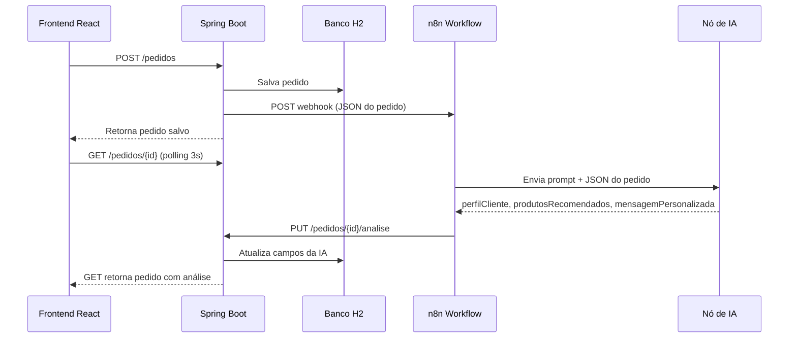

# TrabalhoFinalAI-2026-1
Repositório do grupo 5 para o trabalho final do módulo de IA da turma 35.

# E-commerce com Integração n8n + IA

Projeto full-stack de e-commerce que envia pedidos para automação no **n8n**, recebe análise de IA de forma assíncrona e exibe o resultado no frontend React.

## Estrutura

```
/backend   → Spring Boot 3.x + H2 + JPA
/frontend  → React (Vite) + TailwindCSS + Axios
```

## Fluxo de Dados



## Como Executar

### Backend

```bash
cd backend
./mvnw spring-boot:run
```

- API: `http://localhost:8080`
- H2 Console: `http://localhost:8080/h2-console`
  - JDBC URL: `jdbc:h2:mem:ecommerce`
  - User: `sa`
  - Password: *(vazio)*

### Frontend

```bash
cd frontend
npm install
npm run dev
```

- App: `http://localhost:5173`

### Variáveis

| Arquivo | Variável | Descrição |
|---------|----------|-----------|
| `backend/src/main/resources/application.properties` | `n8n.webhook.url` | URL do webhook do n8n |
| `frontend/.env` | `VITE_API_URL` | URL da API Spring (padrão: `http://localhost:8080`) |

---

## Configuração do Fluxo no n8n

### 1. Nó Webhook (Trigger)

- **Método:** POST
- **Path sugerido:** `/webhook/pedido-analise`
- **Resposta:** Responder imediatamente (200 OK)
- **Payload recebido do Spring:**

```json
{
  "id": 15,
  "cliente": "Maria",
  "cidade": "Petrópolis",
  "valorTotal": 820,
  "produtos": ["Notebook", "Mouse Gamer"]
}
```

Copie a URL de produção/teste do webhook e configure em:

```properties
n8n.webhook.url=http://localhost:5678/webhook/pedido-analise
```

### 2. Nó de IA (OpenAI, Anthropic ou similar)

Use o prompt abaixo como instrução do sistema/usuário no nó de IA.

#### Prompt da IA

```
Você é um Consultor de vendas de uma loja virtual.

Analise o pedido recebido em JSON e retorne APENAS um JSON válido com a seguinte estrutura:

{
  "perfilCliente": "descreva o perfil do cliente com base nos produtos e valor total",
  "produtosRecomendados": "lista de produtos complementares separados por vírgula",
  "mensagemPersonalizada": "mensagem amigável e personalizada para o cliente"
}

Entrada (pedido):
{{ $json }}

Regras:
- Seja objetivo e profissional.
- Recomende de 2 a 4 produtos complementares.
- Se o valor total for alto, sugira perfil Premium e um cupom exclusivo.
- Não inclua texto fora do JSON.
```

**Saída esperada do nó de IA:**

```json
{
  "perfilCliente": "Cliente Premium",
  "produtosRecomendados": "Headset Gamer, SSD 1TB, Mochila para Notebook",
  "mensagemPersonalizada": "Obrigado pela compra!"
}
```

### 3. Nó Function (opcional) — Mapeamento

Se necessário, mapeie os campos da IA para o formato do Spring:

```javascript
const analise = $input.first().json;

return [{
  json: {
    perfilCliente: analise.perfilCliente,
    recomendacoes: analise.produtosRecomendados,
    cupomDesconto: analise.cupomDesconto || "TECH10",
    mensagemIA: analise.mensagemPersonalizada
  }
}];
```

### 4. Nó HTTP Request — Callback para o Spring

- **Método:** PUT
- **URL:** `http://host.docker.internal:8080/pedidos/{{ $('Webhook').item.json.id }}/analise`
  - Use `localhost` se o n8n rodar na mesma máquina sem Docker.
- **Body (JSON):**

```json
{
  "perfilCliente": "{{ $json.perfilCliente }}",
  "recomendacoes": "{{ $json.recomendacoes }}",
  "cupomDesconto": "TECH10",
  "mensagemIA": "{{ $json.mensagemIA }}"
}
```

> **Importante:** Se o n8n estiver em Docker e o Spring no host, use `host.docker.internal` em vez de `localhost`.

---

## Endpoints da API

| Método | Rota | Descrição |
|--------|------|-----------|
| POST | `/pedidos` | Cria pedido, salva no H2 e dispara webhook n8n |
| PUT | `/pedidos/{id}/analise` | Recebe análise da IA (callback do n8n) |
| GET | `/pedidos/{id}` | Consulta pedido atualizado (usado pelo polling do React) |

---

## Publicar no GitHub

```bash
git init
git add .
git commit -m "feat: estrutura inicial do e-commerce com integração n8n"
git branch -M main
git remote add origin <sua-url>
git push -u origin main
```

## Tecnologias

- **Backend:** Spring Boot 3.3, Spring Data JPA, H2, Lombok, RestTemplate
- **Frontend:** React 18, Vite 6, TailwindCSS, Axios
- **Automação:** n8n + nó de IA
